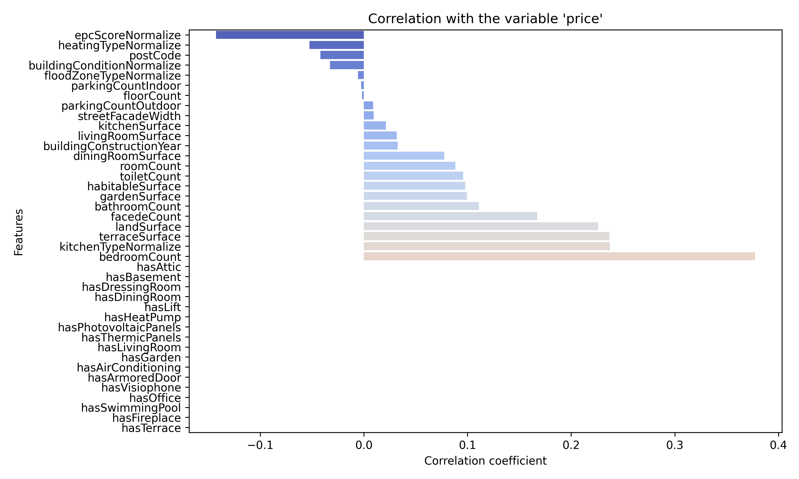

# Data Analysis

## How many rows and columns?

- Number of rows = 76370
- Number of columns = 36

## Plot: Correlation with the variable price

## What is the correlation between the variables and the price? (Why might that be?)

- Positive correlations (e.g., bedroomCount, kitchenTypeNormalize, terraceSurface, landSurface) suggest that larger or more equipped properties tend to have higher prices — which aligns with real estate market expectations.

- Negative correlations (e.g., epcScoreNormalize, heatingTypeNormalize) could indicate that poorer energy performance or certain heating types might lower the value.

## How are variables correlated to each other? (Why?)

#TODO: (Alberto) Find correlations between other variables. Create new plots

While the plot doesn’t directly show inter-variable correlations, we can infer that:

- Variables like bedroomCount, roomCount, habitableSurface, landSurface, and bathroomCount are likely positively correlated among themselves — all relate to property size or livability.

- Boolean features such as hasGarden, hasLift, or hasAirConditioning likely correlate with landSurface or property type (e.g., houses vs. apartments).

These correlations happen because:

- Larger properties tend to have more rooms, land, and additional features.

- Energy efficiency (epcScoreNormalize) and building condition might inversely correlate with price due to renovation needs or regulatory impact.

## Which variables have the greatest influence on the price?

Top 10 Most Influential Variables on Price

<pre>
Rank    Feature                 Correlation
1       bedroomCount            ~0.38
2       kitchenTypeNormalize    ~0.22
3       terraceSurface          ~0.21
4       landSurface             ~0.20
5       facadeCount             ~0.18
6       bathroomCount           ~0.13
7       gardenSurface           ~0.11
8       habitableSurface        ~0.10
9       toiletCount             ~0.09
10      roomCount               ~0.09
</pre>

These features are primarily linked to size, comfort, and functionality, all of which are key drivers in real estate pricing.

## Which variables have the least influence on the price?

Top 10 Least Influential Variables on Price

<pre>
Rank    Feature             Correlation
1       hasTerrace          ~0.00
2       hasFireplace        ~0.00
3       hasSwimmingPool     ~0.00
4       hasOffice           ~0.00
5       hasVisiophone       0.00
6       hasArmoredDoor      ~0.00
7       hasAirConditioning  ~0.01
8       hasGarden           ~0.01
9       hasLivingRoom       ~0.01
10      hasThermicPanels    ~0.01
</pre>

## How many qualitative and quantitative variables are there? 

- Qualitative (str): 17
    - buildingCondition       
    - epcScore                
    - floodZoneType           
    - gardenOrientation       
    - hasAirConditioning      
    - hasArmoredDoor          
    - hasAttic                
    - hasBasement             
    - hasDiningRoom           
    - hasDressingRoom         
    - hasFireplace            
    - hasGarden               
    - hasHeatPump             
    - hasLift                 
    - hasLivingRoom           
    - hasOffice               
    - hasPhotovoltaicPanels   
    - hasSwimmingPool         
    - hasTerrace              
    - hasThermicPanels        
    - hasVisiophone           
    - heatingType             
    - kitchenType             
    - locality                
    - province                
    - subtype                 
    - terraceOrientation      
    - type                    
- Quantitative (int, float): 19
    - bathroomCount           
    - bedroomCount            
    - buildingConstructionYear
    - diningRoomSurface       
    - facedeCount             
    - floorCount              
    - gardenSurface           
    - habitableSurface        
    - kitchenSurface          
    - landSurface             
    - livingRoomSurface       
    - parkingCountIndoor      
    - parkingCountOutdoor     
    - postCode                
    - price                   
    - roomCount               
    - streetFacadeWidth       
    - terraceSurface          
    - toiletCount      

## How would you transform these values into numerical values?

- buildingCondition:
    - missing value = -1 
    - GOOD = 1
    - AS_NEW = 2
    - TO_RENOVATE = 3 
    - TO_BE_DONE_UP = 4
    - JUST_RENOVATED = 5
    - TO_RESTORE = 6   
- epc_scores:
    - missing value = -1 
	- A++ = 1
	- A+ = 2
	- A = 3
	- B = 4
	- C = 5
	- D = 6
	- E = 7
	- F = 8
	- G = 9
	- G_C = 9 (for ranges we take the lowest score)
	- F_D = 8
	- C_A = 5
	- F_C = 8
	- E_C = 7
	- C_B = 5
	- E_D = 7
	- G_F = 9
	- D_C = 6
	- G_E = 9
	- X = 0
- heating_types:
    - missing value = -1 
	- GAS = 1
	- FUELOIL = 2
	- ELECTRIC = 3
	- PELLET = 4
	- WOOD = 5
	- SOLAR = 6
	- CARBON = 7
- flood_zone_types:
    - missing value = -1 
	- NON_FLOOD_ZONE = 1
	- POSSIBLE_FLOOD_ZONE = 2
	- RECOGNIZED_FLOOD_ZONE = 3
	- RECOGNIZED_N_CIRCUMSCRIBED_FLOOD_ZONE = 4
	- CIRCUMSCRIBED_WATERSIDE_ZONE = 5
	- CIRCUMSCRIBED_FLOOD_ZONE = 6
	- POSSIBLE_N_CIRCUMSCRIBED_FLOOD_ZONE = 7
	- POSSIBLE_N_CIRCUMSCRIBED_WATERSIDE_ZONE = 8
	- RECOGNIZED_N_CIRCUMSCRIBED_WATERSIDE_FLOOD_ZONE = 9
- kitchen_types:
    - missing value = -1 
	- NOT_INSTALLED = 0
	- SEMI_EQUIPPED = 1
	- INSTALLED = 2
	- HYPER_EQUIPPED = 3
	- USA_UNINSTALLED = 0 (we use the same values for USE and non USA)
	- USA_SEMI_EQUIPPED = 1
	- USA_INSTALLED = 2
	- USA_HYPER_EQUIPPED = 3

## Percentage of missing values per column?

<pre>
Data                        type    Non-null count  Missing count  Missing %  Unique values
hasAirConditioning          object            1124          79244  98.601433              1
hasSwimmingPool             object            1816          78552  97.740394              1
hasDressingRoom             object            2628          77740  96.730042              1
hasFireplace                object            3044          77324  96.212423              1
hasThermicPanels            object            3112          77256  96.127812              1
hasArmoredDoor              object            3698          76670  95.398666              1
gardenOrientation           object            5601          74767  93.030808              8
diningRoomSurface          float64            6901          73467  91.413249             89
hasHeatPump                 object            7473          72895  90.701523              1
hasPhotovoltaicPanels       object            8048          72320  89.986064              1
hasOffice                   object           10387          69981  87.075702              1
terraceOrientation          object           11262          69106  85.986960              8
hasAttic                    object           12516          67852  84.426637              1
hasDiningRoom               object           14141          66227  82.404688              1
streetFacadeWidth          float64           15510          64858  80.701274            746
hasGarden                   object           15958          64410  80.143838              1
gardenSurface              float64           15958          64410  80.143838           1735
hasVisiophone               object           15991          64377  80.102777              1
parkingCountOutdoor        float64           18326          62042  77.197392             46
hasLift                     object           19044          61324  76.304002              1
roomCount                  float64           21948          58420  72.690623             48
kitchenSurface             float64           24263          56105  69.810123            119
parkingCountIndoor         float64           28239          52129  64.862881             86
terraceSurface             float64           28599          51769  64.414941            236
livingRoomSurface          float64           28950          51418  63.978200            194
hasBasement                 object           29315          51053  63.524039              1
floorCount                 float64           37546          42822  53.282401             40
landSurface                float64           39541          40827  50.800070           4374
kitchenType                 object           41916          38452  47.844913              8
hasLivingRoom               object           42876          37492  46.650408              1
floodZoneType               object           44466          35902  44.672009              9
heatingType                 object           47153          33215  41.328638              7
hasTerrace                  object           47429          32939  40.985218              1
buildingConstructionYear   float64           49106          31262  38.898567            229
facedeCount                float64           53239          27129  33.755973             12
toiletCount                float64           55094          25274  31.447840             26
buildingCondition           object           57992          22376  27.841927              6
epcScore                    object           65391          14977  18.635527             20
bathroomCount              float64           66672          13696  17.041609             30
habitableSurface           float64           67783          12585  15.659218           1015
bedroomCount               float64           73558           6810   8.473522             42
price                      float64           76370           3998   4.974617           5921
subtype                     object           80368              0   0.000000             26
postCode                     int64           80368              0   0.000000           1100
province                    object           80368              0   0.000000             11
locality                    object           80368              0   0.000000           5470
type                        object           80368              0   0.000000              4
</pre>

#TODO: (Alberto) Maybe display some pie charts showing existing values vs. missing values for some variables (maybe the most influencial variables)