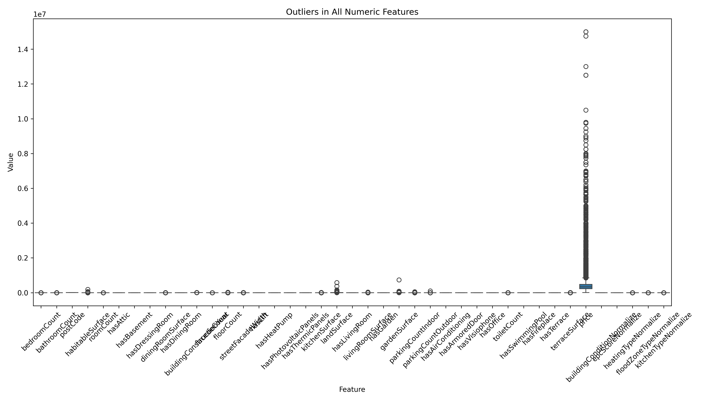

# Data Interpretation

## Plot the outliers

## Which variables would you delete and why ?

- Irrelevant variables:
    - Unnamed
    - id
    - url 
- Variable where 100% of the values are missing 
    - monthlyCost
    - accessibleDisabledPeople
    - hasBalcony
- streetFacadeWidth: >80% cells are empty and there's no logical value that we can put in

## Represent the number of properties according to their surface using a histogram.

## In your opinion, which 5 variables are the most important and why?

<pre>
Rank	Feature	                Correlation     Coefficient	Interpretation
1	    bedroomCount	        ~0.38	        More bedrooms tend to significantly increase the property's price.
2	    kitchenTypeNormalize	~0.22	        Higher-end or fully equipped kitchens are associated with higher prices.
3	    terraceSurface	        ~0.21	        Larger terraces add value to the property.
4	    landSurface	            ~0.20	        More land generally means a more valuable property.
5	    facadeCount	            ~0.18	        More façades (e.g., corner properties) tend to be more expensive.
</pre>

## What are the most expensive municipalities in Belgium? (Average price, median price, price per square meter)

## What are the most expensive municipalities in Wallonia? (Average price, median price, price per square meter)

## What are the most expensive municipalities in Flanders? (Average price, median price, price per square meter)

## What are the less expensive municipalities in Belgium? (Average price, median price, price per square meter)

## What are the less expensive municipalities in Wallonia? (Average price, median price, price per square meter)

## What are the less expensive municipalities in Flanders? (Average price, median price, price per square meter)

