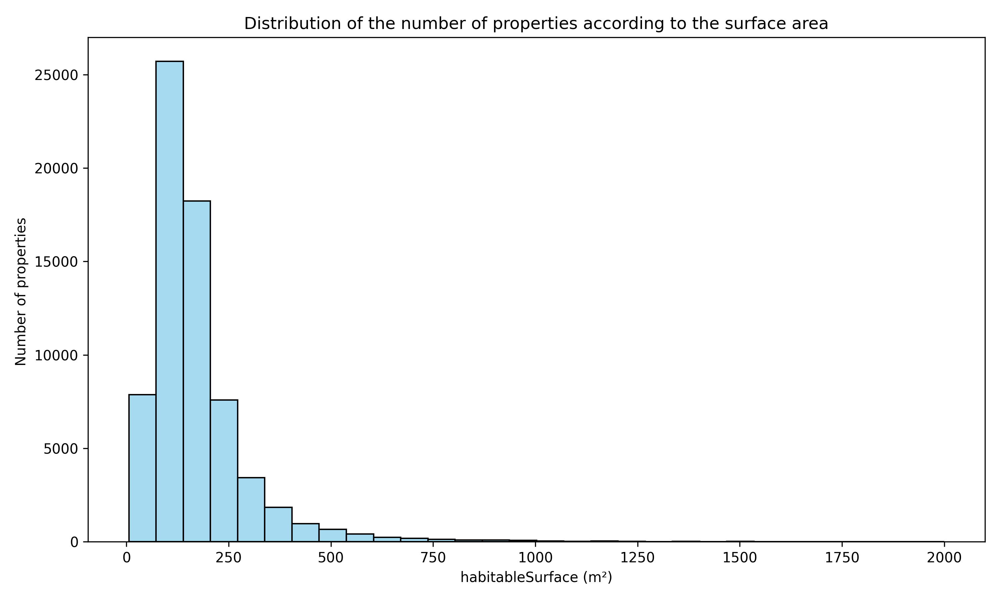
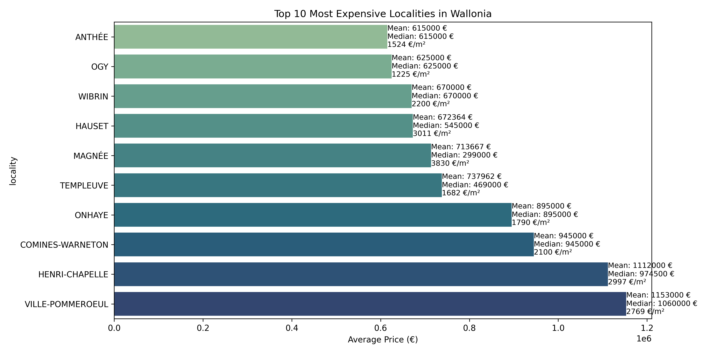

# Data Interpretation

## Plot the outliers

### Key Insights

- Most Problematic Features (Red numbers = extreme outliers):
    - **parkingCountIndoor** (6623): high number of outliers
        - Most properties don't have indoor parking (likely the "normal" case, especially for apartments, older homes, or properties in dense urban areas)
        - Some properties have unusually high indoor parking counts (likely large residential complexes, luxury properties)
    - **price** (6047): high number of outliers
        - There are many properties with unusually high or low prices
    - **habitableSurface** (4189), **landSurface** (3967), **terraceSurface** (1873), **gardenSurface** (1625) => many outliers
        - Suggesting wide variation in property sizes
    - **toiletCount** (2870), **bathroomCount** (2140) => Show moderate outlier patterns
- Well-Behaved Features (Green numbers = few outliers):
    - **roomCount** (121) and **diningRoomSurface** (372 outliers): relatively normal
    - **facadeCount** (14 outliers):  very consistent across properties 
- What This Tells Us:
    - **Price Variation**: The real estate market has extreme price diversity - from very cheap to very expensive properties, which is typical for real estate markets
    - **Property Size Diversity**: There's huge variation in property sizes, from tiny apartments to large estates
    - **Standard Features**: Basic features like number of rooms and facades are fairly consistent, suggesting most properties follow common architectural patterns
    - **Data Quality**: The high number of outliers in key features like price and surface area is normal for real estate data, as properties naturally vary widely in value and size

## Which variables would you delete and why ?

- Irrelevant variables:
    - **Unnamed**
    - **id**
    - **url** 
- Variable where 100% of the values are missing 
    - **monthlyCost**
    - **accessibleDisabledPeople**
    - **hasBalcony**
- **streetFacadeWidth**: >80% cells are empty and there's no logical value that we can put in
- **parkingCountIndoor**: 
    - Why remove: Extremely high outlier count suggests this feature is either mostly zeros with rare extreme values, or has data quality issues
    - Possible action: Could keep but transform (e.g., create binary "has indoor parking" feature)

## Represent the number of properties according to their surface using a histogram.

## In your opinion, which 5 variables are the most important and why?

<pre>
Rank	Feature	                Correlation     Coefficient	Interpretation
1	    bedroomCount	        ~0.38	        More bedrooms tend to significantly increase the property's price.
2	    kitchenTypeNormalize	~0.22	        Higher-end or fully equipped kitchens are associated with higher prices.
3	    terraceSurface	        ~0.21	        Larger terraces add value to the property.
4	    landSurface	            ~0.20	        More land generally means a more valuable property.
5	    facadeCount	            ~0.18	        More façades (e.g., corner properties) tend to be more expensive.
</pre>

## What are the most expensive municipalities in Belgium? (Average price, median price, price per square meter)

## What are the most expensive municipalities in Wallonia? (Average price, median price, price per square meter)

## What are the most expensive municipalities in Flanders? (Average price, median price, price per square meter)

## What are the most expensive municipalities in Brussels? (Average price, median price, price per square meter)

## What are the less expensive municipalities in Belgium? (Average price, median price, price per square meter)

#TODO: (Hajer) Find out less expensive municipalities in Belgium. Create plot

## What are the less expensive municipalities in Wallonia? (Average price, median price, price per square meter)

#TODO: (Hajer) Find out less expensive municipalities in Wallonia. Create plot

## What are the less expensive municipalities in Flanders? (Average price, median price, price per square meter)

#TODO: (Hajer) Find out less expensive municipalities in Flanders. Create plot

## Other interpretations?

#TODO: (Hajer) Find other interpretations and create plots